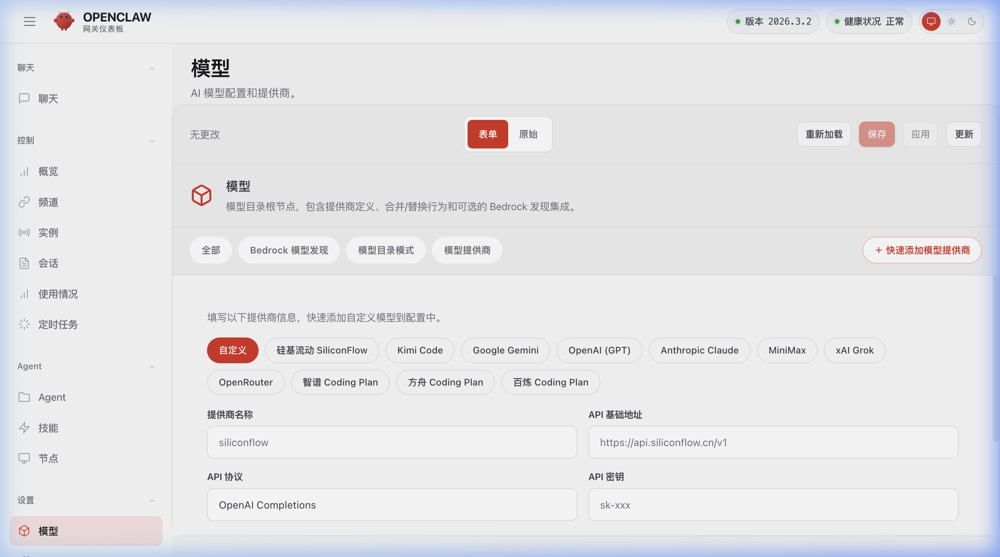
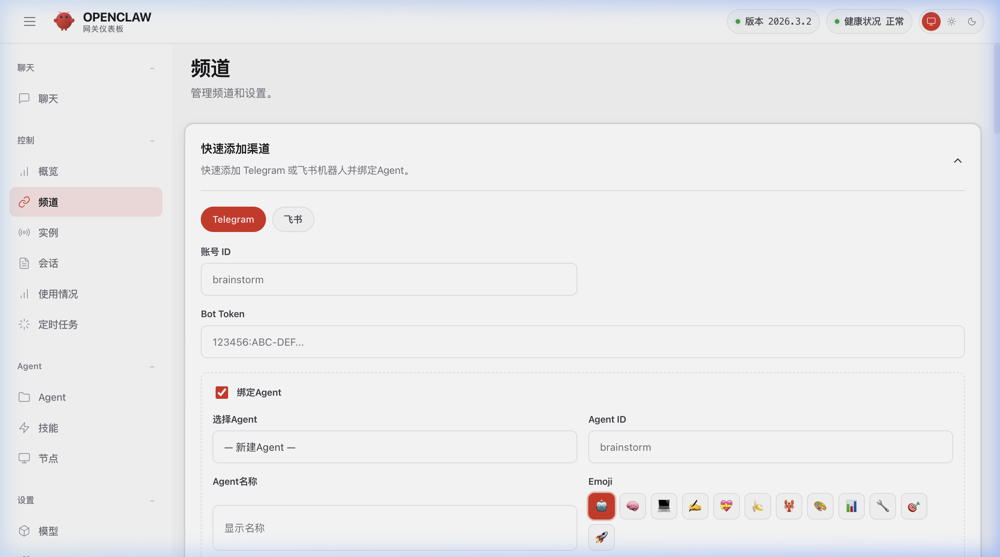
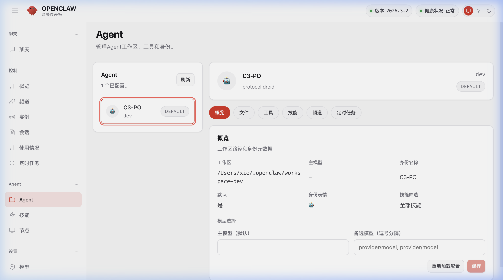

# OpenClaw 中文版 🇨🇳

基于 [OpenClaw](https://github.com/openclaw/openclaw) 的完整中文化分支，包含 **后端 + UI** 的全面增强。

## ✨ 特性

### 🌐 全面中文化

- 控制面板完整中文界面（导航、配置、Agent、频道、定时任务等）
- Schema 配置项中文标签和帮助文本（700+ 条翻译）
- 搜索支持中文匹配

### 📊 实时 Agent 状态监控

- Overview 页面新增 Agent 活动状态卡片（卡片式网格布局）
- 实时显示会话处理状态（处理中 / 等待中 / 空闲）
- 处理中状态绿色脉冲动画，5 秒自动轮询刷新

### ⚡ 快速配置

- 快速添加模型提供商（预置 11 家：硅基流动 SiliconFlow、Kimi Code、Google Gemini、OpenAI GPT、Anthropic Claude、MiniMax、xAI Grok、OpenRouter、智谱 Coding Plan、方舟 Coding Plan、百炼 Coding Plan）
- 快速添加消息频道（Telegram / 飞书一键配置 + Agent 绑定）
- 视觉模型自动标识

### 🛠 UI 增强

- 独立「编辑 JSON」页面（主导航直达，按需加载 raw 配置文本）
- 自定义 Tooltip 组件（替代原生浏览器 title 提示）
- Usage 页面自动刷新
- Block Streaming 支持（飞书消息分段实时发送）

### 🛡 性能修复

- 修复大配置文件 `config.get` RangeError 崩溃问题
- Session 状态追踪独立于 diagnostics 开关，始终启用

## 📸 截图预览

### 快速添加模型提供商



### 快速添加消息渠道



### Agent 管理



## 📦 安装

### 先决条件

- **Node.js 22** 或更新版本

```bash
# 检查 Node 版本
node --version
# 应输出 v22.x.x 或更高
```

> 如未安装 Node.js，前往 [nodejs.org](https://nodejs.org/) 下载安装，或使用 `nvm install 22`。

---

### macOS / Linux

#### 方式一：直接安装（最简单）

```bash
npm install -g https://github.com/josephxie1/openclaw-UI--Chinese/releases/download/v1.0.0/openclaw-2026.3.2.tgz
```

#### 方式二：一键脚本安装（自动检测并安装 Node.js）

```bash
curl -fsSL https://raw.githubusercontent.com/josephxie1/openclaw-UI--Chinese/main/scripts/install-remote.sh | bash
```

#### 方式三：手动下载安装

从 [Releases](https://github.com/josephxie1/openclaw-UI--Chinese/releases) 下载最新的 `.tgz` 文件，然后：

```bash
# 安装（后端 + UI 完整替换）
npm install -g openclaw-2026.3.2.tgz

# 验证安装
openclaw --version

# 启动网关
openclaw gateway
```

#### 方式三：从源码构建

```bash
git clone https://github.com/josephxie1/openclaw-UI--Chinese.git
cd openclaw-UI--Chinese
pnpm install
pnpm build
pnpm pack
npm install -g openclaw-*.tgz
```

---

### Windows

#### 方式一：直接安装（最简单）

```powershell
npm install -g https://github.com/josephxie1/openclaw-UI--Chinese/releases/download/v1.0.0/openclaw-2026.3.2.tgz
```

#### 方式二：一键脚本安装（自动检测并安装 Node.js）

以 **管理员身份** 打开 PowerShell，运行：

```powershell
iwr -useb https://raw.githubusercontent.com/josephxie1/openclaw-UI--Chinese/main/scripts/install-remote.ps1 | iex
```

#### 方式三：手动下载安装

1. 从 [Releases](https://github.com/josephxie1/openclaw-UI--Chinese/releases) 下载最新的 `.tgz` 文件
2. 以 **管理员身份** 打开 PowerShell 或 CMD，运行：

```powershell
npm install -g openclaw-2026.3.2.tgz

# 验证安装
openclaw --version

# 启动网关
openclaw gateway
```

#### 方式三：从源码构建

```powershell
git clone https://github.com/josephxie1/openclaw-UI--Chinese.git
cd openclaw-UI--Chinese
pnpm install
pnpm build
pnpm pack
npm install -g openclaw-2026.3.2.tgz
```

> **注意**：安装会替换已有的 `openclaw` 全局安装。如需恢复官方版，运行 `npm install -g openclaw`。

## ⚙️ 初始配置

安装后需要创建配置文件 `~/.openclaw/openclaw.json`：

```bash
# 初始化配置
openclaw config init
```

或手动创建最小配置：

```json
{
  "models": {
    "providers": {
      "my-provider": {
        "baseUrl": "https://api.example.com/v1",
        "apiKey": "your-api-key",
        "api": "openai-completions",
        "models": [
          {
            "id": "model-name",
            "name": "模型显示名称",
            "contextWindow": 128000,
            "maxTokens": 8192
          }
        ]
      }
    }
  },
  "agents": {
    "defaults": {
      "model": "my-provider/model-name",
      "blockStreamingDefault": "on",
      "blockStreamingBreak": "text_end"
    }
  },
  "gateway": {
    "mode": "local",
    "bind": "loopback"
  }
}
```

启动网关后访问 `http://127.0.0.1:18789` 进入控制面板。

## 🔄 更新

```bash
# 下载新版 tgz 后重新安装
npm install -g openclaw-新版本.tgz
```

## 🔄 恢复官方版

```bash
npm install -g openclaw
```

## 📋 翻译覆盖

| 模块                         | 状态       |
| ---------------------------- | ---------- |
| 导航和标签栏                 | ✅         |
| 概览页（含 Agent 状态监控）  | ✅         |
| 聊天界面（含自定义 Tooltip） | ✅         |
| 配置表单（Schema 标签）      | ✅ 700+ 条 |
| 配置表单（Schema 帮助文本）  | ✅ 460+ 条 |
| Agent 管理                   | ✅         |
| 频道管理                     | ✅         |
| 会话管理                     | ✅         |
| 使用统计                     | ✅         |
| 定时任务                     | ✅         |
| 技能管理                     | ✅         |
| 节点管理                     | ✅         |
| 日志 / 调试                  | ✅         |

## 📄 许可证

[MIT](LICENSE) — 基于 [OpenClaw](https://github.com/openclaw/openclaw)（MIT License）。
